# Axon Ivy Form Editor Demos

The Axon Ivy Form Editor is an easy-to-use design tool that lets you create forms visually. Instead of writing code, you simply drag and drop elements to build the screen, making it faster and more accessible for everyone.

This demo project shows how forms can be created and used within a process. It provides three simple and practical examples to help users understand how to design a form, connect it to data, and interact with it step by step—even without deep technical knowledge. For better understanding, each demo is accompanied by a short video walkthrough.

**The tutorials were created for our PRO Designer—only for the second example (Dynamic UI) do we also have a tutorial for our NEO Designer.**

**Simple UI Demo:**  This demo is a simple UI with static elements to demonstrate not only the core features of the Form Editor. As use case, we have implemented an onboarding UI. In addition, we will show you
- how field input can be validated
- how data is transferred from one UI to the next
- how to set some fields to read-only
- how to influence the visibility of fields

[Video Tutorial Simple UI](https://app.supademo.com/demo/cmjcix7zw0016wh0irwpr3p0s)

**Dynamic UI Demo:** A dynamic UI is a user interface that changes its structure, content, or behavior at runtime based on user input, data, or context. For Axon Ivy, the key setting for this is Update Form on Change — but let’s go through it step by step.

[Video Tutorial Dynamic UI](https://app.supademo.com/demo/cmjb7s95v0054wz0ib8sahygj)  
[Video Tutorial Dynamic UI for NEO Designer](https://app.supademo.com/demo/cmltielbq014b010ik9j66sg1)

**Table UI Demo:** In this example, we show how to configure a dynamic table in the UI, i.e. a table that allows rows to be created at runtime and supports calculations based on the table content.

[Video Tutorial Table UI](https://app.supademo.com/demo/cmjbhfvry0001zf0hermiv6a6)

## Demo

### Simple UI
This demo is a simple UI with static elements to demonstrate not only the core features of the Form Editor. As use case, we have implemented an onboarding UI. In addition, we will show you
- how field input can be validated
- how data is transferred from one UI to the next
- how to set some fields to read-only
- how to influence the visibility of fields

| First UI | Second UI | 
|----------|----------|
| 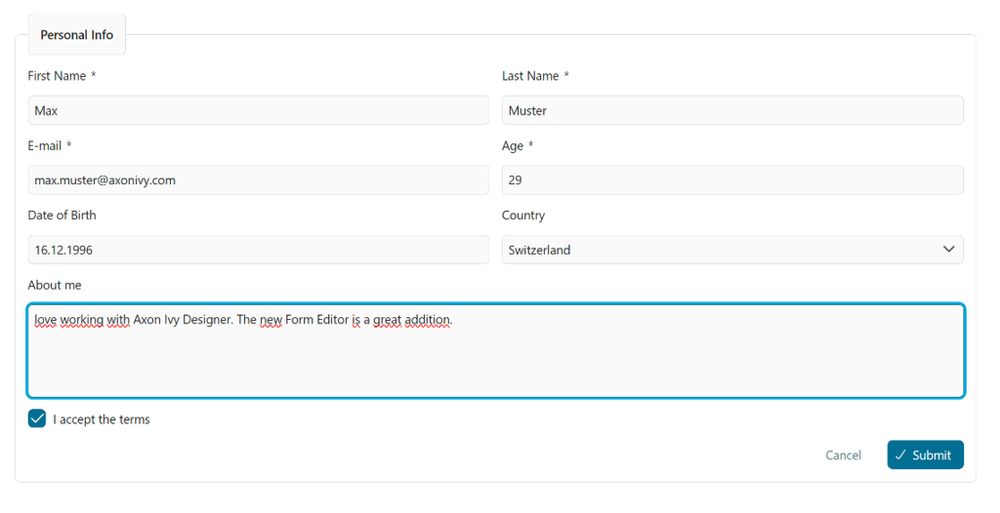  | 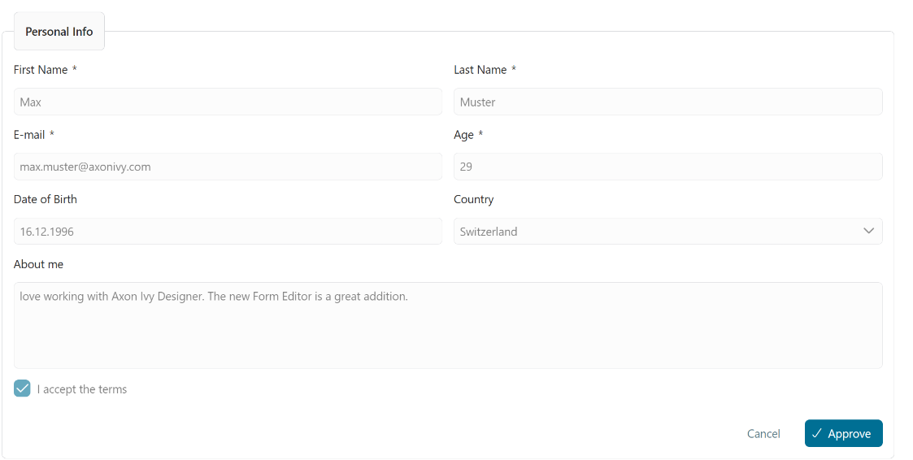 |

The documentation below is not a step-by-step guide. For that, you can check out our  [video tutorial](https://app.supademo.com/demo/cmjcix7zw0016wh0irwpr3p0s)

We create a Dialog and a Data Class:

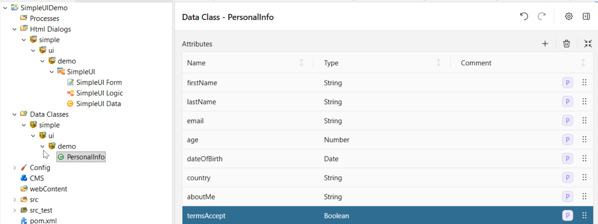

And a second data class connected to our UI:

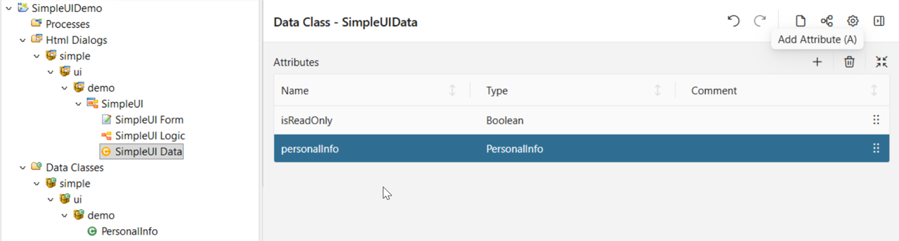

Now we can start to visually create our form - do not forget to save your data, otherwise it will not be accessible in the forms editor

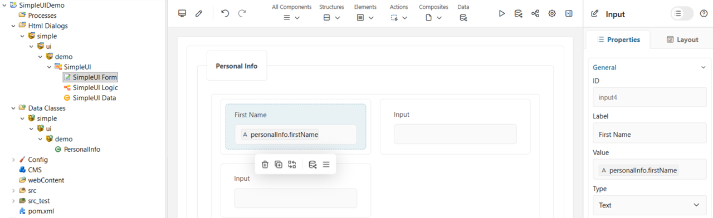

We add a condition to the Disable field so we can set our Input fields to read-only: (need that later, just keep it in mind for now)

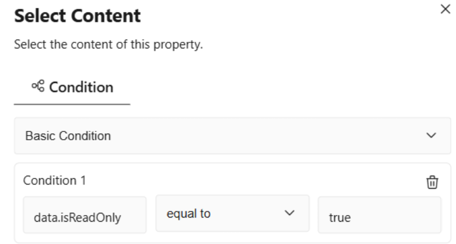

For making fields mandatory use the required field below: 

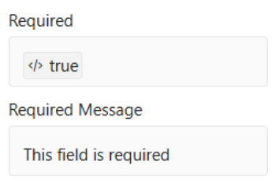

The first screen contains mandatory text fields for First Name and Last Name, an email field with validation, a numeric age input, a date picker for date of birth, a country dropdown, a textarea for a short description, a terms acceptance checkbox, and submit and cancel buttons.

After modelling the entire form 2 very important buttons must be added: proceed and cancel. Click the database symbol at the bottom of the UI

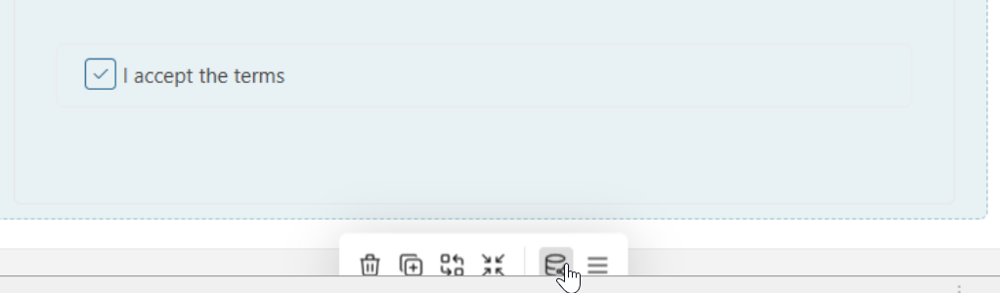

and create them by activating the checkbox:

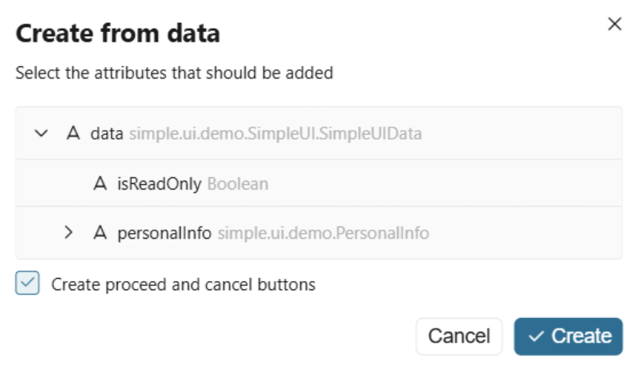

For these fields now the visibility is controlled:

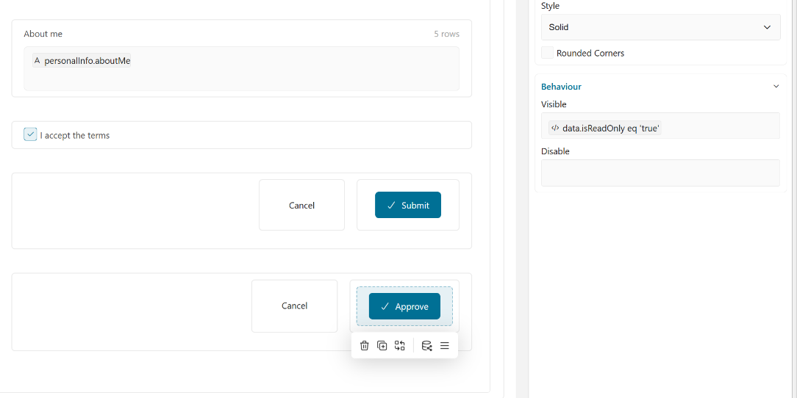

Cancel/Submit is only visible if data.isReadOnly is set to `true`.

Cancel/Approve is only visible if data.isReadOnly is set to `false`.

Some magic data mapping must happen now in our logic of the UI element:

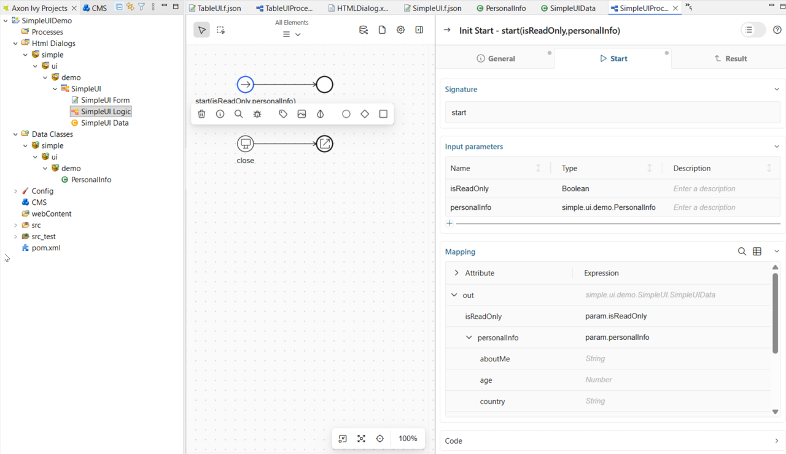

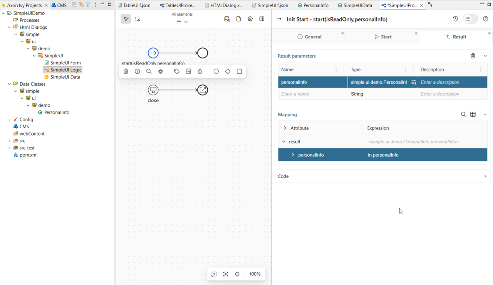

For using the UI we have to integrate it into a process and map the data accordingly, so we create another data class:

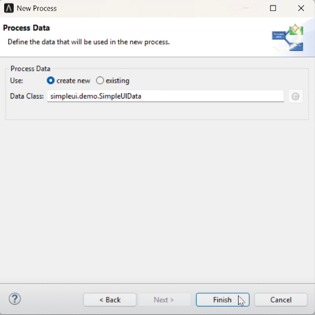

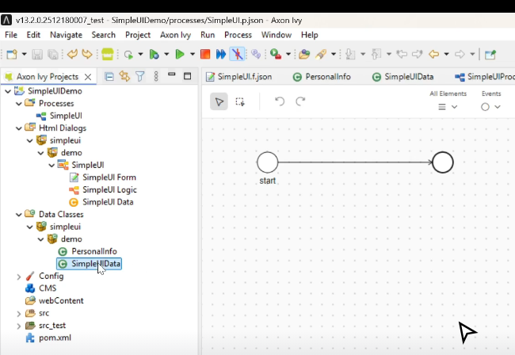

and add again the formerly created PersonalInfo:

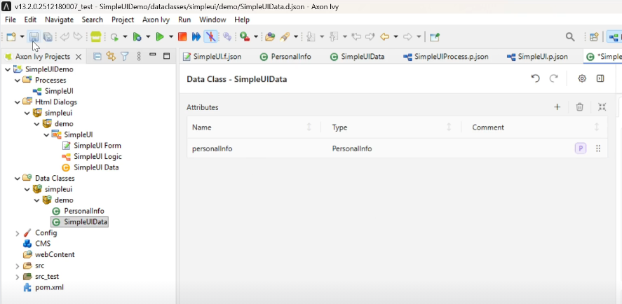

Our process contains 2 User Dialoges - for the ReadOnly version “isReadOnly” must be set to `true`. In addition data from the first dialog element must be mapped.

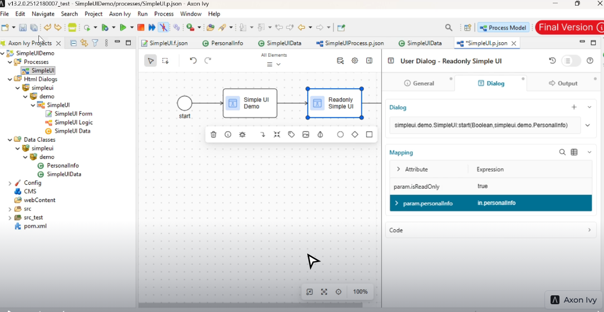

### Dynamic UI Demo

A dynamic UI is a user interface that changes its structure, content, or behavior at runtime based on user input, data, or context. For Axon Ivy, the key setting for this is Update Form on Change — but let’s go through it step by step. Again, we have prepared a super detailed video for you, check [this](https://app.supademo.com/demo/cmjb7s95v0054wz0ib8sahygj?utm_source=link) - the documentation below is just a summary.

In this UI, the “Federal State” select menu is only visible when Germany is selected as the country.

| `country != Germany` | `country == Germany`| 
|----------|----------|
| 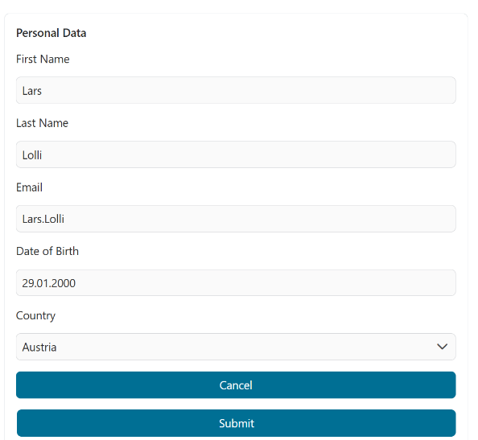 | 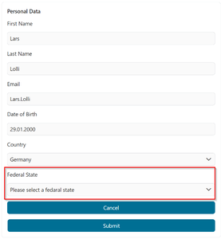 |
|  | Federal states are shown only if Germany is selected as the country. |

The only “magic” in this example is enabling “Update form on Change” for the Country select menu and making the visibility of the Federal State select menu dependent on that field.

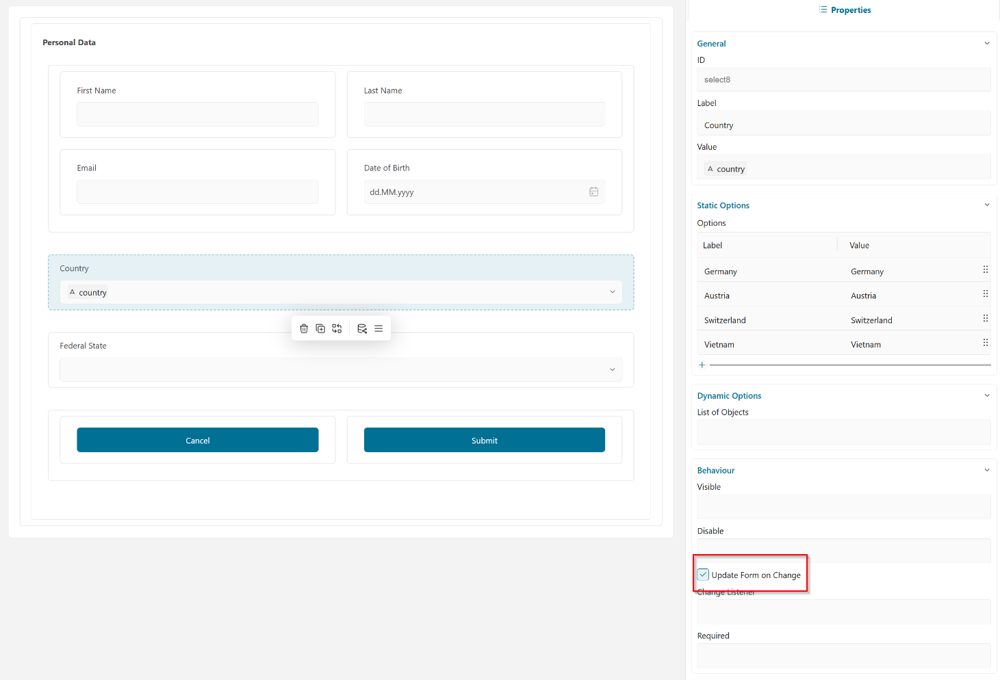

 ... making the visibility of the Federal State select menu dependent on country eq Germany by configuring the visibility field:

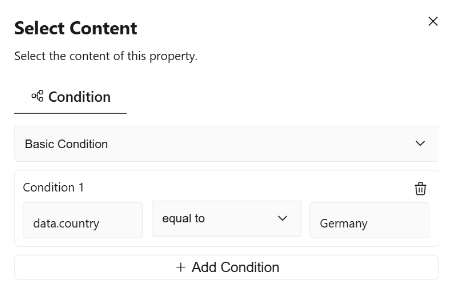

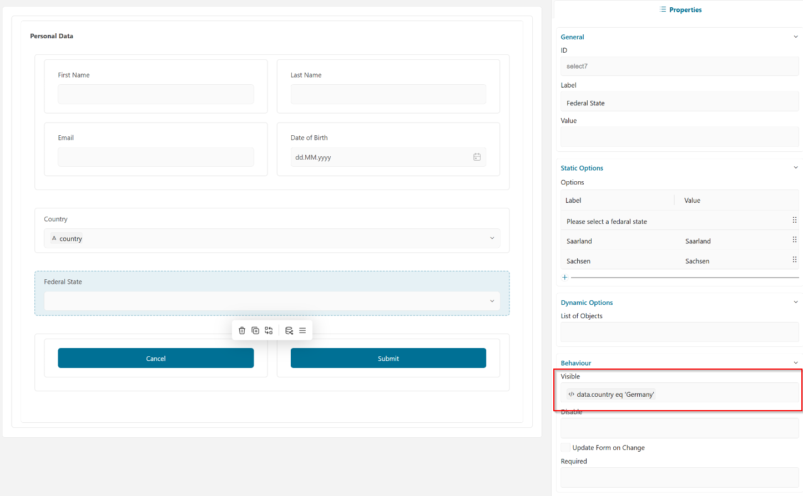

### Table UI Demo

In this example, we show how to configure a dynamic table in the UI, i.e. a table that allows rows to be created at runtime and supports calculations based on the table content.

For a detailed video instruction check [this](https://app.supademo.com/demo/cmjbhfvry0001zf0hermiv6a6)

UI for a table row:

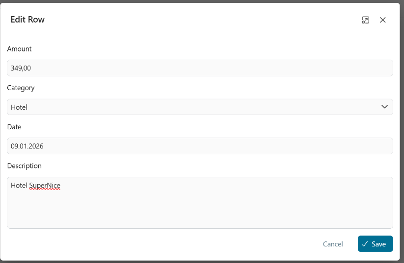

And how it will look like in the table:

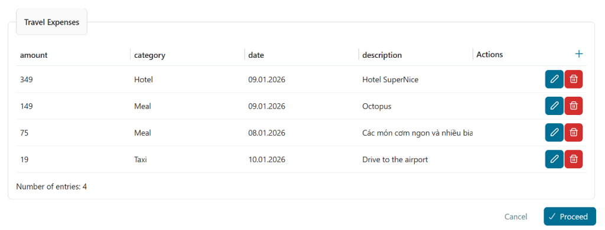

The use case for our example is a travel expense form.

Let’s take a closer look at the data structure, as it is a bit tricky. We define a new data class with one attribute per table column.

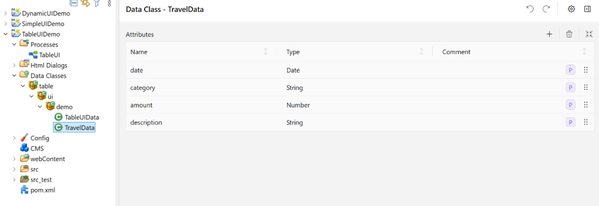

We define a list of this data class : 

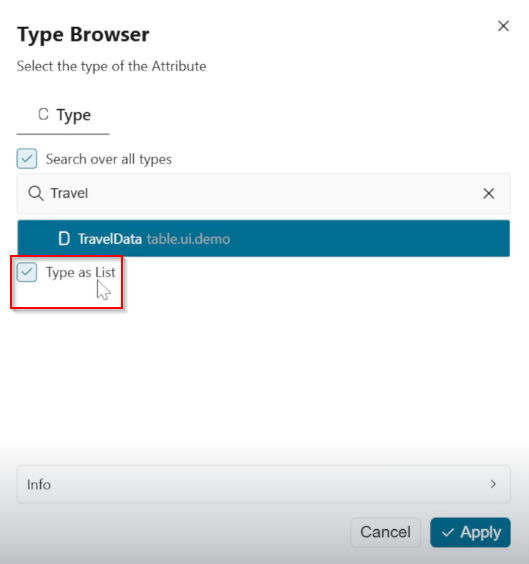

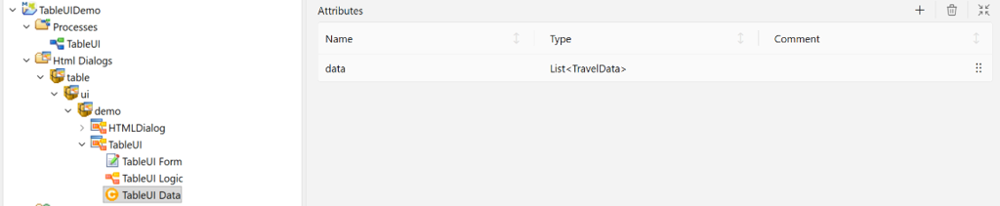

… and add this list as data source to our table:

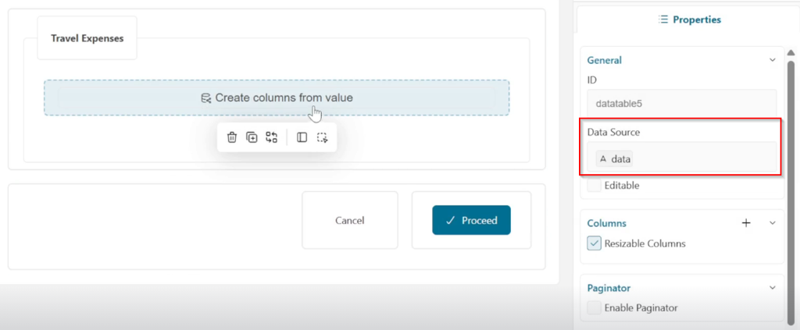

