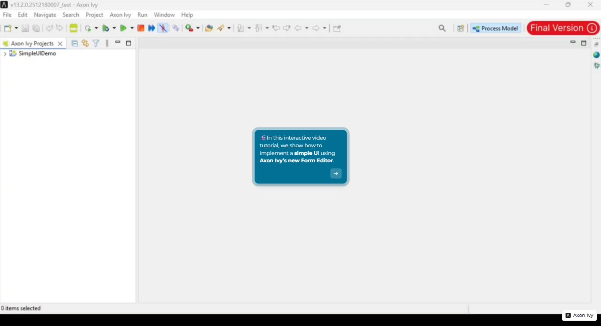
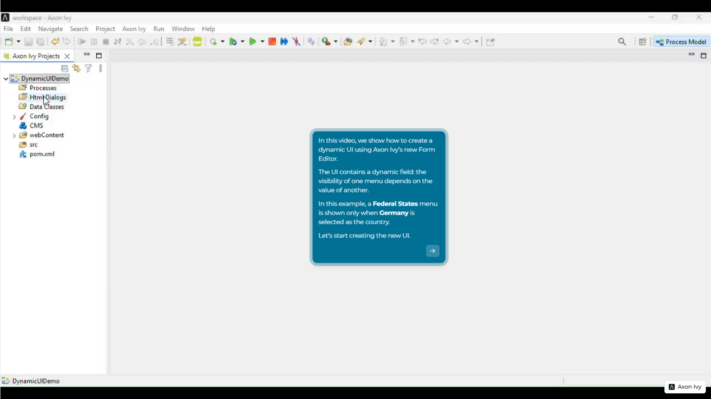
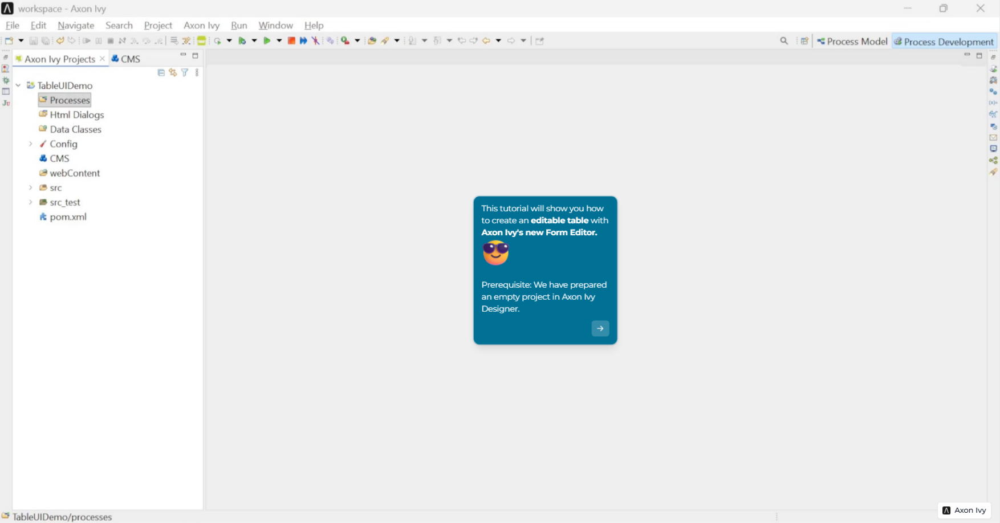

# Axon Ivy Form Editor Demos

The Axon Ivy Form Editor is an easy-to-use design tool that lets you create forms visually. Instead of writing code, you simply drag and drop elements to build the screen, making it faster and more accessible for everyone.

This demo project shows how forms can be created and used within a process. It gives 3 simple and practical examples so that users can understand how to design a form, connect it to information, and interact with it step by step—even without deep technical knowledge.

## Demo

Ready to build a form? These short videos walk you through the entire process from dragging your first element onto the canvas to connecting it with real data. This shows you how we implemented the demo examples step by step. No coding required. Just watch, learn, and start creating your own form in Axon Ivy Neo Designer.

### Simple UI Demo

### Dynamic UI Demo

### Table UI Demo
